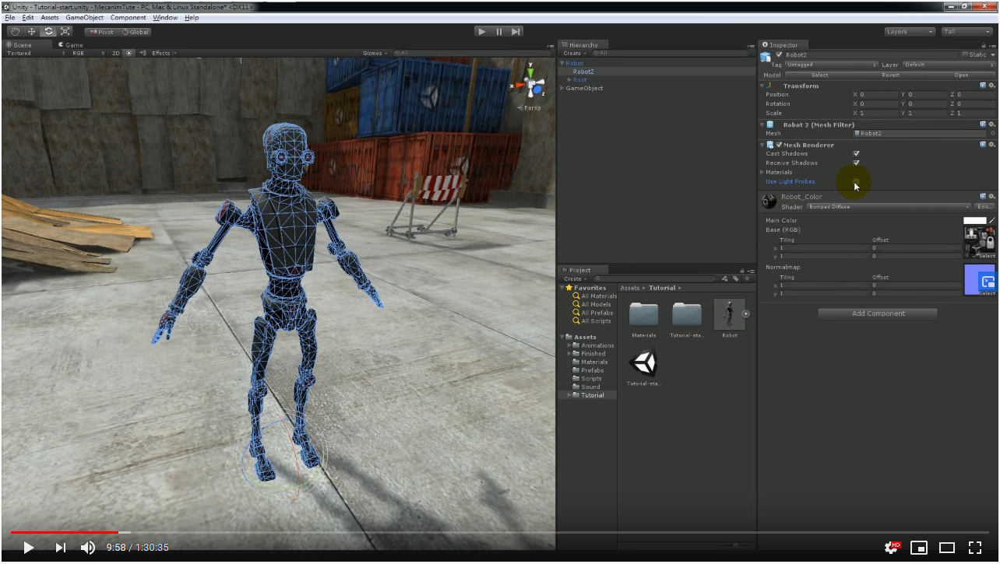

# MecanimTute
阿葉的 Animator 教學

## 調高模型亮度

原教學透過點選 Use Light Probes 來使得黯淡的模型變得明亮，但新的編輯器已無該選項，因此改透過修改 Robot_Color 的 Shader，選擇有 
Self-Illumin 的 Shader 可以達到相同效果。

[參考網站](https://blog.csdn.net/w742874584/article/details/50650191)
